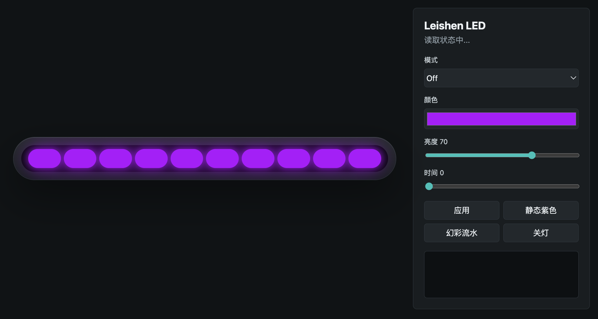

# Leishen MIX II PRO / MIX PRO AR LED Control for Linux

Linux native LED/RGB control service for the **Leishen MIX II PRO** and **Leishen MIX PRO AR** mini PCs. It ports the Leishen T-Control lighting protocol to Linux and provides a Web UI, CLI, HTTP API, and systemd service for controlling the device LED effects.

中文：雷神 MIX II PRO / 雷神 MIX PRO AR 迷你 PC / T-Control 灯效 Linux 控制服务，支持网页控制台、命令行、HTTP API、开机自启和状态恢复。


## Web UI Preview



## Features

- Control Leishen MIX II PRO and MIX PRO AR LED/RGB lighting on Linux
- Web dashboard available from localhost, LAN, and Tailscale/CGNAT ranges
- CLI commands for mode, color, brightness, speed, and status
- HTTP API for custom automation and integrations
- systemd service with boot-time auto start
- Saves the latest effect to `/var/lib/leishen-led/state.json` and restores it after reboot
- Built-in IP allowlist to reduce accidental exposure

## Supported Hardware

- Leishen MIX II PRO mini PC
- Leishen MIX PRO AR mini PC
- Other Leishen devices using the same EC LED protocol may work, but are not tested

## Quick Start

```bash
sudo ./install.sh
```

The installer builds and installs:

```text
/opt/leishen-led/bin/leishen_led
/opt/leishen-led/bin/leishen-ledd
/opt/leishen-led/web/*
/etc/systemd/system/leishen-led.service
/var/lib/leishen-led/state.json
```

Check service status:

```bash
systemctl status leishen-led.service
```

Open the Web UI:

```text
http://127.0.0.1:8787/
http://192.168.x.x:8787/
http://100.64.x.x:8787/
```

## CLI Usage

```bash
sudo /opt/leishen-led/bin/leishen_led status
sudo /opt/leishen-led/bin/leishen_led mode flow
sudo /opt/leishen-led/bin/leishen_led color 178 0 255
sudo /opt/leishen-led/bin/leishen_led brightness 70
sudo /opt/leishen-led/bin/leishen_led time 0
sudo /opt/leishen-led/bin/leishen_led set --mode static --color 178 0 255 --brightness 70 --time 0
```

## Lighting Modes

```text
0 off
1 static
2 breathing
3 flow
4 flash
5 successively
6 marquee
7 scanning
8 meteor
```

## API

```text
GET  /api/status
GET  /api/presets
GET  /api/modes
POST /api/apply
POST /api/effect
POST /api/off
```

`POST /api/apply` request:

```json
{
  "mode": "static",
  "brightness": 70,
  "color": [178, 0, 255],
  "time": 0
}
```

After each successful write, the service saves the current effect to `/var/lib/leishen-led/state.json` and restores it on the next boot.

## Network Access

The daemon listens on `0.0.0.0:8787`, but only allows requests from:

```text
127.0.0.0/8
100.64.0.0/10
192.168.0.0/16
```

If UFW is installed, the installer also adds:

```bash
ufw allow from 100.64.0.0/10 to any port 8787 proto tcp
ufw allow from 192.168.0.0/16 to any port 8787 proto tcp
ufw deny from any to any port 8787 proto tcp
```

The service validates the source IP itself. Requests outside the allowlist return `403`.

## Hardware Details

EC ports:

```text
data: 0x62
cmd:  0x66
```

LED whitelist offsets:

```text
0x95 mode
0x98 brightness
0x9A red
0x9B green
0x9C blue
0x9D time high
0x9E time low
```

## Uninstall

Keep the last saved lighting state:

```bash
sudo ./uninstall.sh
```

Remove the service and saved state:

```bash
sudo ./uninstall.sh --purge
```

## GitHub Topics

Recommended repository topics:

```text
leishen
leishen-mix-ii-pro
leishen-mix-pro-ar
linux
led-control
rgb-control
mini-pc
systemd
embedded-controller
ec
tailscale
```

Recommended repository description:

```text
Linux LED/RGB control service for Leishen MIX II PRO and MIX PRO AR mini PCs with Web UI, CLI and systemd support.
```
